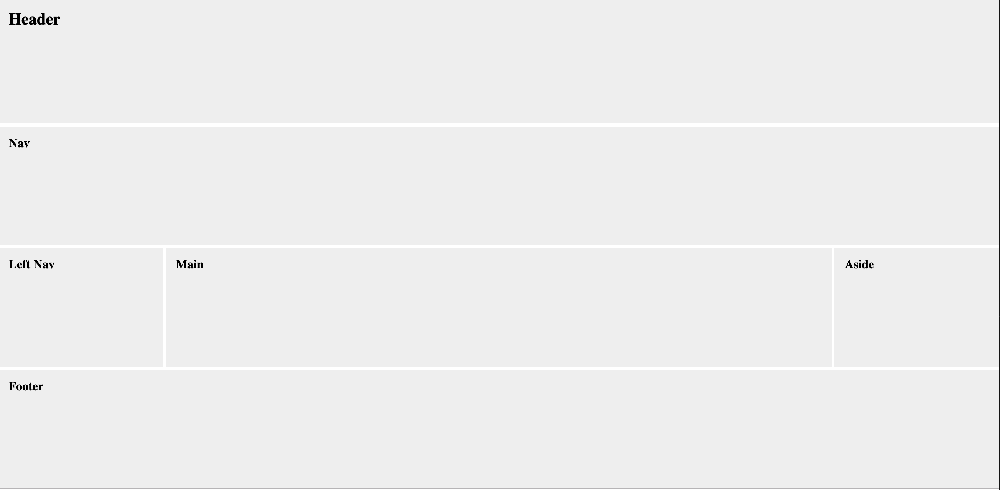

# Grid layout

The new layout techniques come from using the value `grid` with the display property:
`display: grid;`

It's worth exploring all of the layouts that are made possible using grids. They allow us to think about are content in a way similar to laying out with the CSS table layout becasuse we have a two dimension layout to work with.   See the links at the bottom of this assignment page for some ideas on how to experiment with grids.    

Back in 2006,  there was a common layout that involved a header, a footer, a top nav bar, a left nav aside, and a right aside.  It was called the ["Holy Grail"](https://alistapart.com/article/holygrail) layout.  If you read the article, you'll see that back then there was a lot of tinkering involved.  In this assignment we'll create the Holy Grail layout with minimal effort using Grid layout properties.

## Assignment  

1. Begin the assignment by adding a style sheet to index.html file provided.  Reset some of the properties as follows:
```
 * {
      box-sizing: border-box;
      padding: 0;
      margin: 0;
    }
```
2. Set the height of the document to the full height of the screen:
```
html,
    body {
      height: 100vh;
    }
```
3. We'll style using some of the semantic tags and some of the classes.  First apply the grid layout to the container.  Use the fractional unit so that the grid cells fill the space provided. Use a grid gap to provide a space between cells. Set the height to 100% to fill the screen.  Set the background color to a shade of gray.  If you view your layout now it should appear as it would on a mobile browser as we coding mobile first.
```
.container {
  display: grid;
  grid-template-columns: 1fr;
  grid-gap: 5px;
  height: 100%;
}
.container>* {
  background: #eeeeee;
}
```
4. Provide some padding within each cell in the grid:
```
.container>header,
  nav,
  aside,
  section,
  footer {
    padding: 20px;
  }
```
5. Use a media query to achieve the desired layout for larger screens.  This is done by setting up 6 grid cells and only allowing some of them to span the entire width of the screen:
 ```
 @media only screen and (min-width: 600px) {
    .container {
      grid-template-columns: repeat(6, 1fr);
    }

    .container header,
    .container nav,
    .container footer {
      grid-column: span 6;
    }

    .container section {
      grid-column: span 4;
    }
  }
```  
Notice that we get our left and right columns by allowing the html element between the assides only 4 of the 6 columns specified.  What would you change if you only wanted a right column?


## Resources
[Grid Garden Game](https://cssgridgarden.com/)  

[Common Responsive Layouts with CSS Grid](https://medium.com/samsung-internet-dev/common-responsive-layouts-with-css-grid-and-some-without-245a862f48df)  

[A Complete Guide To Grid](https://css-tricks.com/snippets/css/complete-guide-grid/)

## Solution


