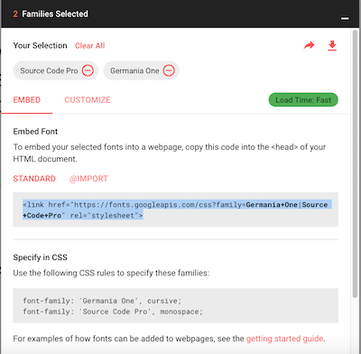
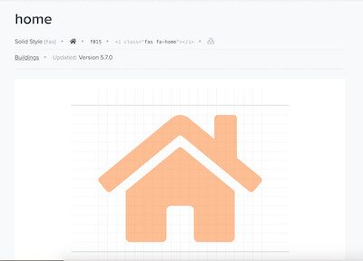
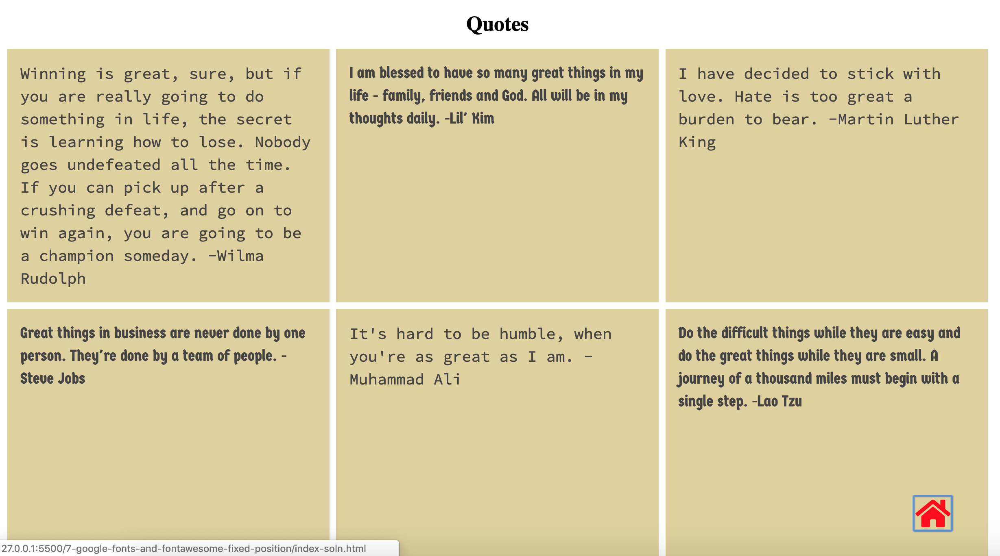

# Google Fonts and Font Awesome

Designers and Developers create new fonts and submit to Google fonts to share their work.  You can use these fonts for free.  Fontawesome provides fonts that render as icons.  A large subset of the Fontawesome fonts are available for free.

We often want to supply a set of links that are accessbible in a fixed position on the web page. This is different than absolution position, which is relative to a container.  With fixed position, we choose a location relative to an edge of the whole window and fix are items there.  

In this exercise, you'll add 2 google fonts and 1 fontawesome icon to your page.  You'll fix the icon to bottom right side of the page.


## Google Fonts
1. Create and add a second style sheet (`css/mystyles.css`) to your index.html.
2. Navigate to [google fonts](https://fonts.google.com) on the web and shop for 2 fonts from 2 different generic families.  Generic families include: "serif", "sans-serif", "cursive", "fantasy", "monospace".  Using the instructions, embed the fonts in the index.html file. See image below for locating embed instructions.
  
When you choose multiple fonts, the embed instructions will group them together.  It can be advantageous to embed separately during development and to split them out just created to `link` entries
```
  <link href="https://fonts.googleapis.com/css?family=Germania+One" rel="stylesheet">
  <link href="https://fonts.googleapis.com/css?family=Source+Code+Pro" rel="stylesheet">
```
3. Make the paragraphs containing quotes alternate between your two fonts. This can be done with CSS even/odd
```
 p:nth-child(even) {
  font-family: 'Germania One', cursive;
}

p:nth-child(odd) {
  font-family: 'Source Code Pro', monospace;
}
```
4. Assign the even font choice to h1.

## Fontawesome

1. Navigate to the fontawesome site [Fontawesome](https://fontawesome.com). If you click on the button "Start Using For Free" it will take you to a page where you can copy the `link` that you need to add to the `head` section of your index.html.  Copy the link and pasted into the `head` section above any links to css files. NOTE: All of my vendor files are above my CSS files so that I can reference them in my CSS file.
2. Search for the **home** icons. Click on the first icon.  You should see what's shown in  the image below.  

3. Copy the `i` tag into your buffer `<i class="fas fa-home"></i>`. The `i` tag used to be used for *italics* rendering, but now it is preferred that you use CSS for that. You can use other inline tags for icon rendering, such as `a` and `span`.  These icons are treated as characters and styled as fonts.
4. Add a `div` tag right below the body tag and give a id name of `home` and paste the `i` tag with the home classes inside of it. We'll use this as a container to positions the home icon.
5. Now wrap an `a`nchor tag around the `i` tag to create a link that will take the user to the top of the page.
```
  <div class="home">
    <a href="">
      <i class="fas fa-home">
      </i>
    </a> 
  </div>
```
5. If you look at your page now, you should see a small home icon in the upper left.  Let's style it to see at the bottom right and be noticable using a high contrast color. Also, add a hover that increases size and changes color to make it more noticable. Notice that we style the container for positioning and the icon is styled as a font.
```
.home {
  position: fixed;
  right: 5%;
  bottom: 5%;
}
.fa-home {
  font-size: 3rem;
  color: red;
}
.fa-home:hover {
  font-size: 5rem;
  color:blue;
}
```
### Test
Scroll down the page.  The home should stay fixed near the bottom right.  Click on it to take you "home" to the top of the page.

### Solution


